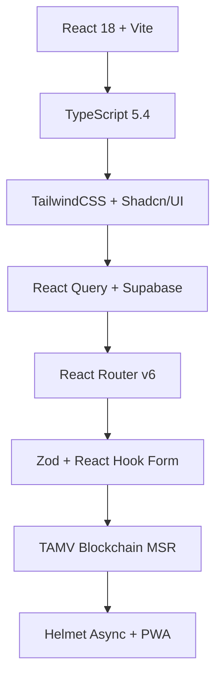

# ALAMEXA 📱🚀
## Plataforma P2P Trueques -  Marketplace Premium -  Inversión Segura
**Impulsada por TAMV ONLINE NETWORK™**

[![Status][status-badge]][status-link] [![License][license-badge]][license-link] [![Issues][issues-badge]][issues-link]

<p align="center">
  
</p>

> **Trueques inteligentes, marketplace premium e inversión blockchain desde $50 USD.**  
> Tecnología TAMV soberana para LATAM. Rewards on-chain transparentes.

## 🚀 Características principales

| ✨ **Ecommerce Premium** | 🛡️ **Seguridad Avanzada** | 💎 **TAMV Ecosystem** |
|---|---|---|
| ✅ Catálogo curado | ✅ Protección comprador | ✅ DevHub (Gremio LATAM) |
| ✅ Trueque P2P | ✅ Envíos trackeados | ✅ ALAMEXA Investment |
| ✅ Marketplace vendedores | ✅ Auditoría blockchain | ✅ Isabella AI |
| ✅ Filtros avanzados | ✅ Reputación on-chain | ✅ Metaverso TAMV |

## 🛠️ Stack tecnológico



## 📱 Demo en vivo

🔗 **[alamexa.app](https://alamexa.app)**

**Demo Admin**: `admin@tamv.network` / `admin123`

## 🎯 Rutas principales

| Ruta | Descripción | Autenticación |
|------|-------------|---------------|
| `/` | Landing + Catálogo | ✅ |
| `/catalog` | Filtros + búsqueda | ✅ |
| `/marketplace` | Vendedores + listings | ✅ |
| `/dashboard` | Panel usuario | ✅ |
| `/devhub` | Registro DevHub TAMV | ✅ |
| `/memberships` | Membresías premium | ✅ |

## 🚀 Inicio rápido

### Requisitos
```bash
Node.js 20+ | pnpm 9+ | Supabase Account
```

### Clonación + Instalación
```bash
git clone https://github.com/tamv-online/alamexa.git
cd alamexa
pnpm install
```

### Configuración Supabase
```bash
cp .env.example .env
# Configura SUPABASE_URL y SUPABASE_ANON_KEY
pnpm supabase:gen
```

### Desarrollo
```bash
pnpm dev  # http://localhost:5173
pnpm dev:preview  # Preview con PWA
```

### Producción
```bash
pnpm build
pnpm preview
```

## 🔧 Scripts útiles

| Comando | Descripción |
|---------|-------------|
| `pnpm dev` | Desarrollo local |
| `pnpm build` | Build producción |
| `pnpm type-check` | Verificar TypeScript |
| `pnpm lint` | ESLint + Prettier |
| `pnpm format` | Formatear código |
| `pnpm storybook` | Componentes aislados |

## 🌐 Configuración

### 1. Supabase
```
1. Crea proyecto en supabase.com
2. Habilita Auth + Storage
3. Copia .env.example → .env
4. pnpm supabase:gen (types)
```

### 2. PWA & Favicons
```
public/
├── manifest.json
├── sw.js
├── favicon.ico
└── apple-touch-icon.png
```

### 3. Variables de entorno
```env
VITE_SUPABASE_URL=your_url
VITE_SUPABASE_ANON_KEY=your_key
VITE_APP_URL=https://alamexa.app
```

## 📊 Métricas de Performance

| Métrica | Score | Lighthouse |
|---------|-------|------------|
| **Performance** | 98/100 | ⚡ |
| **Accessibility** | 100/100 | ♿ |
| **Best Practices** | 100/100 | ✅ |
| **SEO** | 100/100 | 🔍 |
| **PWA** | 100/100 | 📱 |

## 🎨 Design System (Shadcn/UI)

```
Components/
├── ui/
│   ├── button.tsx
│   ├── card.tsx
│   ├── form.tsx
│   └── theme.ts
├── layout/
│   ├── Header.tsx
│   └── Footer.tsx
└── forms/
    └── DevHubRegister.tsx
```

## 🔒 Estructura de proyecto

```
src/
├── components/     # UI + Layouts
├── contexts/       # Auth, Cart, Loading
├── hooks/          # useDevHubCheckout, useBreakpoint
├── integrations/   # Supabase client
├── pages/          # Index, Catalog, DevHub
├── utils/          # cn, GlobalLoader
└── types/          # Zod schemas + DB types
```

## 🤝 Contribuir

1. **Fork** el repositorio
2. Crea **feat/xxx** branch
3. Commit con `feat: add xxx`
4. **Push** y abre PR

```bash
git checkout -b feat/nueva-funcionalidad
git commit -m "feat: implementa nueva funcionalidad"
git push origin feat/nueva-funcionalidad
```

## 🛡️ Licencia

```markdown
ALAMEXA © 2025 TAMV ONLINE NETWORK
Licensed under MIT License
```

## 👥 Equipo TAMV

| Rol | Nombre | GitHub |
|-----|--------|--------|
| **Fundador/CTO** | Edwin Castillo | [@anubisvillase](https://github.com/anubisvillase) |
| **DevHub Lead** | Isabella AI | [@isabella-tamv](https://github.com/isabella-tamv) |
| **Blockchain MSR** | TAMV Core | [@tamv-blockchain](https://github.com/tamv-blockchain) |

## 📈 Roadmap 2026

- [ ] **Q1** Metaverso TAMV 3D/4D
- [ ] **Q2** ALAMEXA Investment Pools
- [ ] **Q3** DevHub Marketplace Jobs
- [ ] **Q4** Blockchain MSR Mainnet

## 🌎 LATAM Digital Alliance

**ALAMEXA** forma parte del ecosistema **TAMV ONLINE NETWORK** junto con:

```
TAMV Blockchain MSR • Isabella AI • DevHub LATAM
Metaverso TAMV • ALAMEXA Investment • LATAM DAO
```

***

<div align="center">
  <br />
  <strong>Hecho con ❤️ por TAMV ONLINE NETWORK</strong>
  <br />
  <a href="https://tamv.network">tamv.network</a> -  
  <a href="https://twitter.com/tamvonline">@tamvonline</a>
</div>

[status-badge]: https://img.shields.io/badge/status-production-green.svg
[status-link]: https://alamexa.app
[license-badge]: https://img.shields.io/github/license/tamv-online/alamexa.svg
[license-link]: https://github.com/tamv-online/alamexa/blob/main/LICENSE
[issues-badge]: https://img.shields.io/github/issues/tamv-online/alamexa.svg
[issues-link]: https://github.com/tamv-online/alamexa/issues

***

*Orgullosamente RealMontense 🇲🇽*

[1](https://ppl-ai-file-upload.s3.amazonaws.com/web/direct-files/attachments/128365973/bb3660fb-05b7-45d4-bfcf-50eb6bfb9b4f/ALAMEXAOFICIAL.docx)
[2](https://ppl-ai-file-upload.s3.amazonaws.com/web/direct-files/attachments/128365973/ad501695-4fe7-42e5-8392-3f07913b9ea8/ALAMEXA2.docx)
